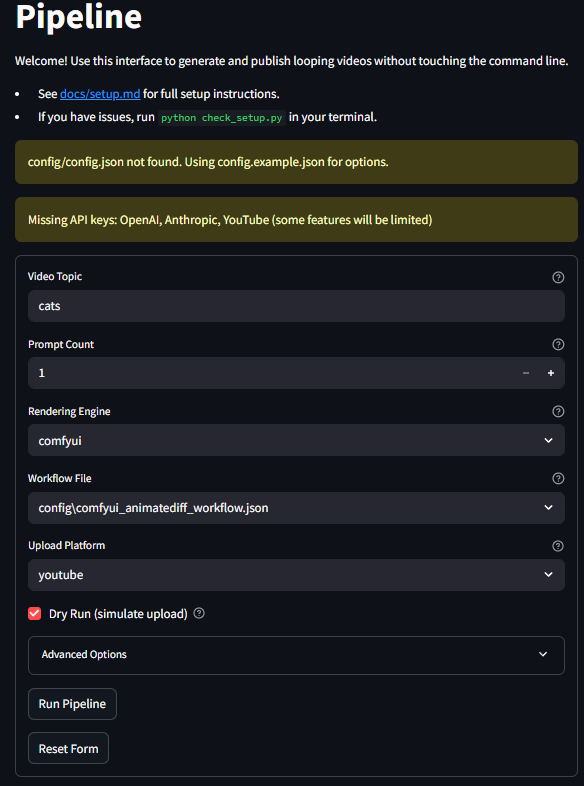

# LoopForge
<!-- Optional: Add a logo or banner image here -->
<!--  -->

**LoopForge helps you automate your entire short-form video creation workflow, from idea to upload, using free and open-source tools on your local machine.**

A locally-powered, automated solo content pipeline for creating and publishing looping video content for platforms like YouTube Shorts, TikTok, and Instagram Reels.

## Table of Contents
- [Project Overview](#project-overview)
- [Core Components](#core-components)
- [Key Features](#key-features)
- [Project Structure](#project-structure)
- [Getting Started](#getting-started)
  - [Prerequisites](#prerequisites)
  - [Installation](#installation)
- [Usage](#usage)
  - [Configuration](#configuration)
  - [Running the Full Pipeline](#running-the-full-pipeline)
  - [Running Individual Stages](#running-individual-stages)
- [Notifications & Alerts](#notifications--alerts)
- [Reliability & Logging Improvements](#reliability--logging-improvements)
- [Roadmap](#roadmap)
- [Contributing](#contributing)
- [Acknowledgements](#acknowledgements)
- [License](#license)

## Project Overview
LoopForge is a bootstrapped, automation-heavy approach to content creation and distribution. It leverages local tools, AI, and scripting to generate engaging video loops without relying on paid subscription services.

### Core Components
- **Automated Ideation & Prompting**: Using Claude/OpenAI to generate content ideas and detailed prompts.
- **Local Visual Generation**: Open Source Stable Diffusion variants (AnimateDiff/Deforum) running on local GPU.
- **Scripted Video Processing**: FFmpeg and MoviePy for looping, captioning (via OpenAI Whisper CLI), and assembly.
- **Scripted Publishing**: OSS libraries for cross-platform publishing.
- **MVP Backend Prototype**: Simple API for content generation (early platform foundation).

## Key Features
- 🎬 **End-to-End Automation**: From content ideation to platform publishing.
- 💻 **Local First**: Runs on your own hardware, ensuring privacy and control.
- 💰 **Cost-Effective**: Leverages free and open-source software to minimize recurring costs.
- 🤖 **AI-Powered Content**: Utilizes LLMs for prompt generation and Whisper for captions.
- 🔧 **Modular & Customizable**: Scripts for each pipeline stage can be run independently or modified.
- 📢 **Notifications**: Get alerts for pipeline events via Email, Slack, and Discord.

## Project Structure
```
Loop-forge/
├── .github/              # GitHub Actions workflows
├── api_prototype/        # FastAPI prototype for the platform
├── assets/
│   ├── b_roll/           # B-roll footage for video enhancement
│   └── branding/         # Logos, watermarks, and brand elements
├── config/               # Configuration files for API keys, etc.
├── data/
│   ├── prompts_to_render/  # Generated prompts queue
│   ├── rendered_clips/     # Raw output from SD/AnimateDiff
│   └── ready_to_post/      # Processed videos ready for publishing
├── docs/                 # Documentation (setup, technical details)
└── src/
    ├── prompt_generation/ # Scripts for generating prompts
    ├── rendering/         # Scripts for local rendering
    ├── post_processing/   # Video processing scripts
    ├── upload/            # Platform upload scripts
    └── notifications.py   # Notification utility
    └── run_pipeline.py    # Main pipeline orchestrator
```

## Getting Started

### Prerequisites
- Python 3.8+
- FFmpeg installed and in PATH
- Local GPU (e.g., NVIDIA 3060 Ti or better) for rendering
- API keys for OpenAI/Claude (if using AI prompt generation)
- InvokeAI or ComfyUI with AnimateDiff installed for local rendering

### Installation
1.  **Clone the repository:**
    ```bash
    git clone https://github.com/Nitefawkes/Loopforge.git
    cd Loopforge
    ```
2.  **Install required Python packages:**
    ```bash
    pip install -r requirements.txt
    ```
    *Note: `requirements.txt` may need to be generated or updated based on all imported packages.*
3.  **Set up Configuration:**
    *   Copy `config/config.example.json` to `config/config.json`.
    *   Edit `config/config.json` to add your API keys (OpenAI, Anthropic, YouTube) and configure notification settings (Email, Slack, Discord webhook URLs).
4.  **Follow the detailed setup guide:** `docs/setup.md` for environment-specific instructions (FFmpeg, rendering engines, etc.).

## 🖥️ Visual Pipeline: Streamlit GUI

LoopForge now includes a no-code, user-friendly web interface for running the entire video pipeline!



**Features:**
- Select your video topic, prompt count, rendering engine, workflow, and upload platform
- Advanced options for captions, B-roll, watermark, and scheduling
- Live output logs and easy reset/download options
- Config and API key checks for smooth onboarding

**To launch the GUI:**
```bash
pip install streamlit
python -m streamlit run gui.py
```

See the [User Guide in docs/setup.md](docs/setup.md#how-to-use-the-loopforge-gui) for a full walkthrough.

## Usage

### Configuration
Key operational settings, API keys, and notification preferences are managed in `config/config.json`. Ensure this file is correctly populated before running the pipeline. The `config.example.json` provides a template of all available options.

### Running the Full Pipeline
To run the entire pipeline from prompt generation to upload:
```bash
python src/run_pipeline.py --all --topic "your desired video topic" --count 5
```
- `--topic`: Specifies the subject for AI-generated video prompts.
- `--count`: Number of video prompts to generate.
- Other arguments might be available; use `python src/run_pipeline.py --help` for full options.

The pipeline will:
1. Generate prompts and save them to `data/prompts_to_render/`.
2. Render videos using the configured local engine and save them to `data/rendered_clips/`.
3. Process the rendered clips (looping, captions, B-roll, watermark) and save them to `data/ready_to_post/`.
4. Upload the final videos to configured platforms.

### Running Individual Stages
You can also run specific stages of the pipeline:

-   **Generate Prompts:**
    ```bash
    python src/prompt_generation/generate_prompts.py --topic "vintage aesthetics" --count 3
    ```
    *Output: JSON prompt files in `data/prompts_to_render/`*

-   **Render Videos (from generated prompts):**
    ```bash
    python src/rendering/local_renderer.py --engine comfyui
    ```
    *Input: Reads prompts from `data/prompts_to_render/`*
    *Output: Video files in `data/rendered_clips/`*

-   **Process Videos:**
    ```bash
    python src/post_processing/process_video.py
    ```
    *Input: Reads videos from `data/rendered_clips/`*
    *Output: Processed video files in `data/ready_to_post/`*

-   **Upload Videos:**
    ```bash
    python src/upload/upload_video.py --platform youtube --dry-run
    ```
    *Input: Reads videos from `data/ready_to_post/`*
    *Output: Uploads to specified platforms (or simulates with `--dry-run`)*

Refer to `docs/setup.md` and individual script help (`--help`) for more detailed options.

## Development Phases (Original)
1.  **Local Dev Environment Setup**: Install Python, FFmpeg, SD/AnimateDiff, required libraries
2.  **Core Pipeline Scripts**: Build prompt generator, local renderer, video processor, and uploader
3.  **First Content & MVP Prototype**: Create initial content and simple web service
4.  **Automation Loop & Iteration**: Create watch folders, batch process, and continuously improve

## Strategy Notes (Original)
- **Zero Recurring Cost**: Leverages existing software/libraries and local hardware
- **Full Control**: Own the entire pipeline code
- **Building Platform IP**: Every script is an early version of the platform's core logic
- **Focus on Core Task**: Get content live, then automate that process

## Enhancements (Original Ideas)
- **Niche Selection**: Use Google Trends (5-year view) for "trending but durable" check
- **Brand & Channels**: Secure domain, create mobile-first landing page
- **Affiliate Integration**: Apply for high-ticket recurring SaaS programs
- **Production Improvements**: Auto B-roll injection, caption generation
- **Cost Control**: Render drafts at 720p locally before cloud rendering at 4K
- **Content Buffer**: Batch 45-60 shorts upfront to maintain consistent posting schedule
- **Notion Prototype**: Create public Notion page mimicking the "Video Idea Generator" for early validation


## Notifications & Alerts
LoopForge now supports multi-channel notifications for pipeline events:
- **Email** (via SMTP)
- **Slack** (via webhook)
- **Discord** (via webhook)

Alerts are sent on pipeline failures, timeouts, and successful completions. Video processing and upload completions also trigger notifications.

Configure notification settings in `config/config.json` under the `notifications` section. You can enable/disable each channel and set credentials/webhooks as needed.

## Reliability & Logging Improvements
- The pipeline now logs stdout/stderr for each stage, checks for expected outputs, and provides granular logging.
- On any error or failure, the pipeline exits with a nonzero code and sends an alert if notifications are enabled.
- A summary of pipeline stage results is printed and logged at the end.

## Roadmap
<!-- TODO: Add a brief project roadmap here. What are the next key features or milestones? -->
- Example: Integration with more rendering engines.
- Example: Web UI for managing pipeline.
- Example: Advanced analytics for published content.

## Contributing
Contributions are welcome! Whether it's bug reports, feature suggestions, or code contributions, please feel free to:
1.  **Open an issue** on GitHub to discuss bugs or new ideas.
2.  **Fork the repository** and submit a pull request for any changes.

Before submitting a pull request, please ensure your code is formatted and linted (e.g., using `flake8`). If you're adding new features, please also update any relevant documentation.

<!-- Optional: Create a CONTRIBUTING.md for more detailed guidelines. -->

## Acknowledgements
<!-- TODO: Add acknowledgements to any key open-source projects, guides, or inspirations if desired. -->
- This project leverages the power of FFmpeg, MoviePy, OpenAI Whisper, and various Stable Diffusion UIs/libraries.

## License
[MIT License](LICENSE)
